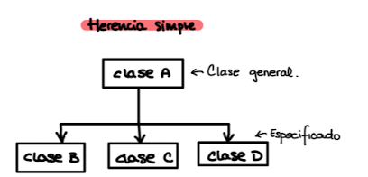

# Apuntes día 8 de noviembre

### Herencia

En la herencia simple tenemos la clase padre donde tenemos funciones generalizadas que podremos utilizar más tarde en las clases hijo donde podré utilizar los métodos padre y los propios del hijo.

Además también se puede causar un *override* sobre las funciones padre para especificarlas en la clase hijo.



Una clase *abstracta* define que quieres hacer pero no como lo hace, en Ruby no hay que formalizar estar clases abstractas.

Para definir una herencia:
```ruby
Class hija < madre

end
```
Ruby cuenta con las clases _public_, _private_ y _protected_.

* public: De libre acceso (:var)
* private: solo puede acceder el objeto (:var_a, :var_b)
* protected: pueden acceder los objetos de la clase y también las clases hijos.

```ruby
def age_different(other)
    self.age - other.age
end
```

* Si fuera privado el age daría error
* Si el age fuera protected self si podría acceder porque es el mismo tipo de clase