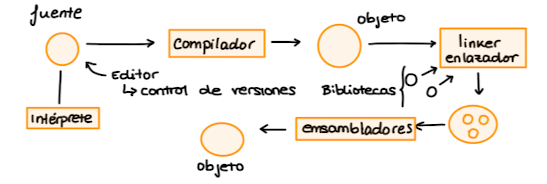

# Apuntes día 5 de octubre

## Introducción a los lenguajes de programación


Las herramientas de programación es un programa que permite la creación, depuración y mantenimiento de otros programas, desde el programa fuente que optenemos en el proceso de creación de un programa pasa a ser un ejecutable que pasa a un sistema de cómputo.

### Las herramientas que utilizamos son:

* Editor de texto: Para crear programa fuente
* Intérprete: Se ejecuta con todas las librerías cargadas
* Compilador
* Ensamblador
* Montador, Linker o Loader: Toma el código en lenguaje máquina y le añade las bibliotecas que también está en lenguaje máquina montando un programa ejecutable.
* Depurador
* Herramientas de construcción: A partir de ciertos ficheros monsta ciertos ejecutables compilando y ensamblando cada uno de ellos.



Normalmente las herramientas se suelen dar juntas en un IDE "Entorno integrado de desarrollo".

### Control de versiones

Un sistema de control de versiones(SCV) permite mantener el estado de un archivo o un conjunto de archivos a través del tiempo de manera que se pueda volver a un punto dado en cualquier momento.

* Sistemas centralizados: Solo el servidor tiene las versiones

* Sistemas de control de versiones distribuidos: Se mantiene una sincronización de las versiones y los ficheros en todos los participantes.

Los sistemas locales y centralizados trabajan con diferencias, no se guarda en cada versión todo el código, si no la diferencia que hay entre los ficheros. En cambio los sistemas distribuidos guardan todo, como git.

### Lenguajes compilados


Generalmente el compilador está escrito en el mismo lenguaje que va a compilar, es decir, un código de C se compila en un compilador escrito en C.

### Fases de la compilación

1.Analisis lexico
2.Analisis sintáctico
3.Analisis semántico y generación de código intermedio
4.Mejora del código intermedio
5.Generación del código
6.Generación del código

#### Analisis léxico

Va leyendo caracter a caracter y creando identificadores válidos

```C++
int numd;
```

Se saca o identifican los tokens y definidos como el _int_ o un _if_. La lista de tokens pasa a la siguiente fase.

