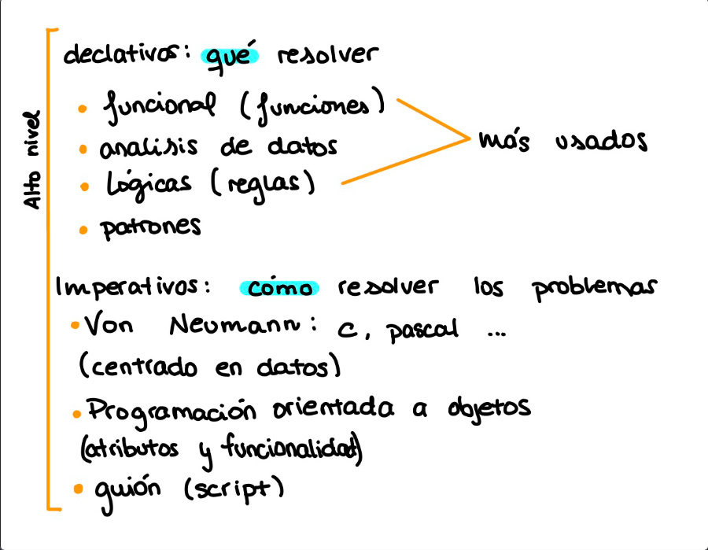

# Apuntes día 29 de septiembre

Lenguaje de programación: Notación para escribir programas.

Bajo nivel: ensamblador, lenguaje de máquina.

Los lenguajes tienen éxito o suelen tenerlo por su patronazgo, que tan _touring_ computable sea y la facilidad de implementación.

Un modelo de programación hace una abstracción de un sistema de cómputo.

Dentro de los lenguajes de alto nivel si está más cerca de los lenguajes humanos o más cerca del lenguaje de máquina, hacemos distinción.



Los lenguajes imperativos usan bucles, y los declarativos usan accesos directos en un conjunto.

*Ejemplo de máximo común divisor en direntes lenguajes*

En C:

```C
while(){
  if(){
    else {
    }
  }
  return;
}
```

En PROLOG:

```PROLOG
mcd():-
mcd(): is ,.
mcd(): -B>A, C.
```

Las primitivas de los lenguajes funcionales son funciones, redundantemente los lenguajes funcionales emplean funciones.

Un lenguaje lógico establece reglas lógicas e inferencias, tienes que dar las reglas al lenguaje.
